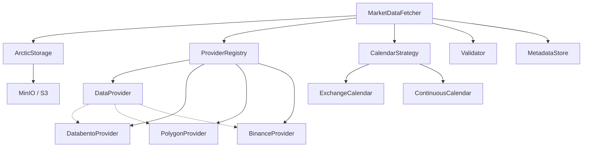
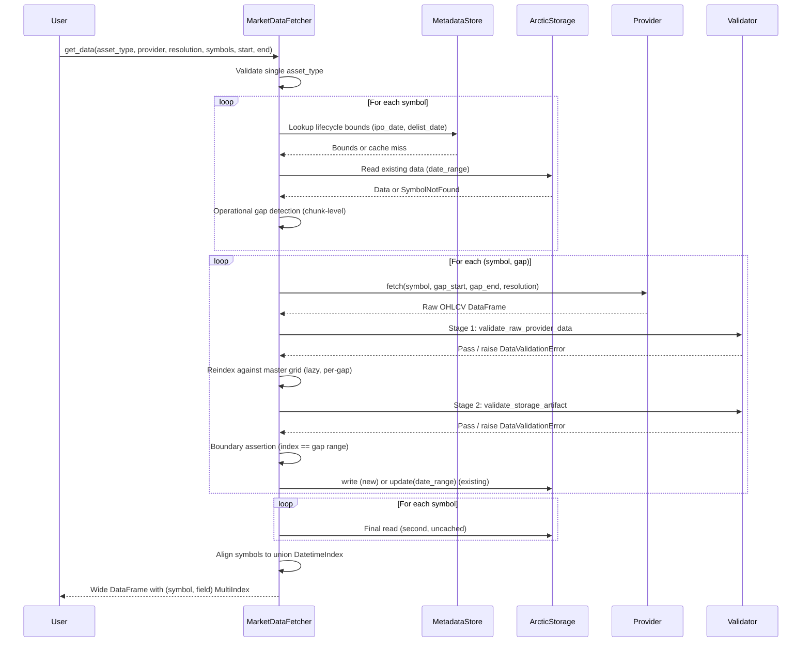
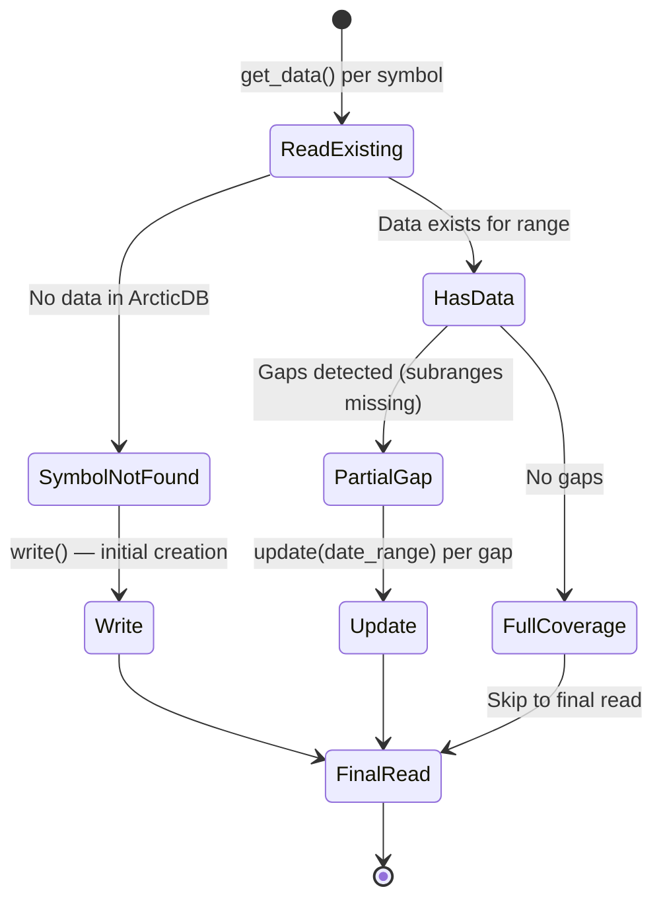
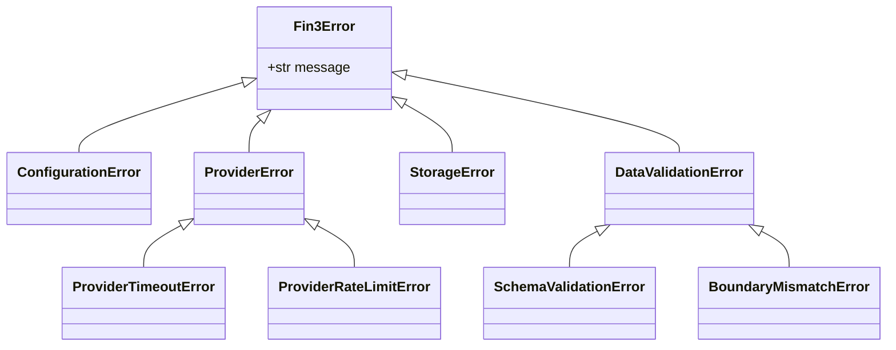

# fin3 - DESIGN.md

## 1. Project Overview

**Project Name**: `fin3`

**Goal**:
Create a reusable Python library that allows backtesting scripts to declaratively request financial time-series data by specifying:
- `asset_type` (equities, crypto, futures, etc.)
- `provider` (databento, polygon, binance, etc.)
- `resolution` (1m, 5m, 1h, 1d, etc.)
- `symbols`: list of tickers
- `start` / `end`: date range

The library must:
1. Check if the required data already exists in ArcticDB (on MinIO).
2. Download only missing portions from the provider.
3. Reindex against a trading calendar master grid, padding zero-volume bars.
4. Validate and store the new data durably.
5. Return a clean, consistent pandas DataFrame with a standardized schema.

This minimizes redundant downloads (cost control) and ensures high data integrity.

**Constraints**:
- **Single asset type per call**: `get_data()` does not support mixing asset types (e.g., equities + crypto) in a single call. Mixing types raises `ValueError`.

**Core Philosophy**:
- **Declarative & idempotent**: Calling `get_data()` multiple times with same params should be safe and efficient.
- **Consumer-agnostic**: Return clean pandas DataFrames (datetime index, OHLCV columns). Consumers like VectorBT Pro can read directly from ArcticDB natively — no conversion layer needed.
- **Extensible**: Easy to add new providers, asset types, resolutions.
- **Reliable**: Strong focus on data integrity, validation, and auditability.
- **Performant**: Suitable for interactive and large-scale backtesting on a dev server.

## 2. Requirements

### Functional Requirements
- Support multiple providers via a plugin-style architecture.
- Precise gap detection per symbol + date range using full verification against an exchange calendar master grid.
- Automatic library naming: `{asset_type}-{resolution}-{provider}`
- Metadata storage (download date, provider version, checksums, asset lifecycle bounds).
- Asset metadata bootstrap via provider reference APIs with discovery-fetch fallback.
- Consistent output schema (datetime index, OHLCV columns, wide MultiIndex format).
- Two-stage validation pipeline (pre-reindex and post-reindex).
- Error handling for network, rate limits, data quality issues.
- Logging of all downloads for cost tracking.

### Non-Functional Requirements
- **Data Integrity**: Checksums, validation, versioning.
- **Cost Efficiency**: Minimize API calls and redundant storage.
- **Pythonic**: Easy to use in Jupyter/notebooks and backtesting scripts.
- **Testable**: High unit + integration test coverage.
- **Dependencies**: Minimal (arcticdb, databento, pandas, pydantic, exchange_calendars, etc.).

## 3. System Architecture

### High-Level Components

```bash
fin3/
├── __init__.py                  # Public API
├── core.py                      # MarketDataFetcher orchestrator
├── config/
│   ├── __init__.py
│   └── settings.py              # Pydantic settings
├── providers/
│   ├── __init__.py
│   ├── base.py                  # Abstract DataProvider
│   ├── databento.py
│   ├── polygon.py               # Future
│   └── binance.py               # Future (crypto)
├── storage/
│   ├── __init__.py
│   └── arctic.py                # ArcticDB + MinIO adapter
├── calendar/
│   ├── __init__.py
│   └── exchange.py              # exchange_calendars integration, master grid generation
├── metadata/
│   ├── __init__.py
│   └── asset_profile.py         # IPO/delisting dates, asset lifecycle bounds
├── utils/
│   ├── __init__.py
│   ├── date_utils.py            # Range calculations, gap detection
│   ├── validation.py            # Two-stage validation pipeline
│   ├── symbol_utils.py
│   └── logging.py
├── exceptions.py
├── schemas.py                   # Data schemas + shared models (output schema, gap results, write metadata)
└── cli.py                       # Optional CLI for manual ingestion
```

**Component Dependencies**:



### Data Flow
1. `get_data(...)` called from backtest script. Validates single asset type constraint.
2. `MarketDataFetcher` determines library name (`{asset_type}-{resolution}-{provider}`).
3. **Metadata Resolution**: For each symbol, check `fin3.metadata` ArcticDB library for cached asset lifecycle bounds (IPO date, delist date). If not cached, query provider reference API (e.g., Databento instrument definitions, Polygon tickers endpoint). If unavailable, perform discovery fetch to establish empirical bounds. Cache results in `fin3.metadata`.
4. **Gap Detection (Operational)**: For each symbol, read existing data from ArcticDB. Break requested range into chunks (trading days for exchange assets, hours for crypto) and check which chunks are missing. No master grid is materialized at this stage. Gap detection read also determines write/update routing (`SymbolNotFound` → `write`, missing chunks → `update`).
5. **Per-Symbol Fetch Loop**: For each symbol with gaps, call `provider.fetch(symbol=..., start=gap_start, end=gap_end, ...)` once per gap interval. Provider returns normalized OHLCV DataFrame (empty DataFrame if no data). Strip any extra columns beyond standard OHLCV.
6. **Stage 1 Validation** (`validate_raw_provider_data`).
7. **Reindexing Step**: Reindex against the master grid for the specific gap range (materialized lazily, per-gap). Inject rows with `volume=0`, `OHLC=NaN` for trade-less minutes. Log informational message if provider returned less data than the full range.
8. **Stage 2 Validation** (`validate_storage_artifact`) → **boundary assertion** (data index matches gap range exactly) → write padded data to ArcticDB via `write` (new symbol) or `update(date_range=...)` (existing symbol).
9. Final read from ArcticDB per symbol (second read, not cached — minimizes peak RAM) → align all symbols to union DatetimeIndex via `pd.concat` → return wide-format DataFrame with `(symbol, field)` MultiIndex columns.

**Data Flow Sequence**:



**ArcticDB Primitives Used**:
- `write` — initial symbol creation (first data for a ticker).
- `update(date_range=...)` — gap filling. Overwrites the specified date range with new data. The `date_range` parameter ensures only the gap is modified.
- `append` — extending existing data forward in time (e.g. daily updates appending new bars).

## 4. Detailed Component Design

### 4.0 Configuration (`config/settings.py`)

All configuration is centralized in `ClientConfig`, a Pydantic `BaseSettings` class with `.env` file support (env prefix `FIN3_`). Provider-specific configuration is modeled as per-provider config objects under a `providers` dict.

```python
class MinioConfig(BaseModel):
    endpoint: str          # e.g., "localhost:9000"
    access_key: str
    secret_key: str
    secure: bool = False   # True for HTTPS

class DatabentoConfig(BaseModel):
    provider_type: Literal["databento"] = "databento"
    api_key: str
    dataset: str = "XNAS.ITCH"

class PolygonConfig(BaseModel):
    provider_type: Literal["polygon"] = "polygon"
    api_key: str

class BinanceConfig(BaseModel):
    provider_type: Literal["binance"] = "binance"
    api_key: str
    api_secret: str = ""

ProviderConfig = Annotated[
    DatabentoConfig | PolygonConfig | BinanceConfig,
    Field(discriminator="provider_type"),
]

class ClientConfig(BaseSettings):
    minio: MinioConfig
    providers: dict[str, ProviderConfig] = {}
    log_level: str = "INFO"    # DEBUG, INFO, WARNING, ERROR
    log_format: str = "json"   # "json" or "console"

    model_config = SettingsConfigDict(
        env_prefix="FIN3_",
        env_file=".env",
        env_nested_delimiter="__",   # FIN3_MINIO__ENDPOINT=localhost:9000
    )
```

**Environment Variable Mapping**:
- `FIN3_MINIO__ENDPOINT`, `FIN3_MINIO__ACCESS_KEY`, `FIN3_MINIO__SECRET_KEY`, `FIN3_MINIO__SECURE`
- `FIN3_PROVIDERS__DATABENTO__API_KEY`, `FIN3_PROVIDERS__DATABENTO__DATASET`
- `FIN3_PROVIDERS__POLYGON__API_KEY`, `FIN3_PROVIDERS__BINANCE__API_KEY`
- `FIN3_LOG_LEVEL`, `FIN3_LOG_FORMAT`

**Retry Policy** (Phase 1 — hardcoded constants):
```python
MAX_RETRIES = 3
INITIAL_BACKOFF_SECONDS = 1.0
MAX_BACKOFF_SECONDS = 30.0
```

Adding a new provider requires: (1) a new config class with a `provider_type: Literal["name"]` field, (2) add it to the `ProviderConfig` union type, (3) an entry in `.env`. The discriminated union ensures Pydantic validates and deserializes each provider config to the correct model based on the `provider_type` field. Since each config class sets a default for `provider_type` (e.g., `DatabentoConfig.provider_type` defaults to `"databento"`), users typically do not need to set it explicitly in `.env` — a single-provider dict key like `FIN3_PROVIDERS__DATABENTO__API_KEY` is sufficient for Pydantic to infer the correct model.

### 4.1 Core - MarketDataFetcher

**AssetType Enum**:
`asset_type` is validated at the API boundary using a strict enum. Invalid values raise a clear error listing valid options.

```python
class AssetType(str, Enum):
    EQUITY_US = "equity_us"
    CRYPTO = "crypto"
    FUTURES = "futures"

class Resolution(str, Enum):
    ONE_MINUTE = "1m"
    FIVE_MINUTE = "5m"
    FIFTEEN_MINUTE = "15m"
    ONE_HOUR = "1h"
    FOUR_HOUR = "4h"
    ONE_DAY = "1d"
```

**Failure Semantics**:
If any symbol fails during a multi-symbol `get_data()` call (network error, validation failure, provider error), the entire call raises an exception. Symbols that were already successfully fetched and written to ArcticDB remain written — on retry, gap detection skips them and only the failed symbol is re-fetched. This is consistent with the declarative & idempotent philosophy: the user retries the same call.

```python
class MarketDataFetcher:
    def __init__(self, config: ClientConfig):
        self.storage = ArcticStorage(config.minio)
        self.providers = ProviderRegistry(config.providers)


    def get_data(
        self,
        asset_type: AssetType,
        provider: str,
        resolution: Resolution,
        symbols: list[str],
        start: datetime,
        end: datetime,
        **kwargs
    ) -> pd.DataFrame:
        # Returns wide-format DataFrame with (symbol, field) MultiIndex columns
        # and a single aligned DatetimeIndex (union of all timestamps).
        pass
```

**Output Format**:
Returns a single `pd.DataFrame` with:
- **Index**: `pd.DatetimeIndex` (UTC, timezone-aware) — the union of all timestamps across all requested symbols, aligned to the master grid.
- **Columns**: `pd.MultiIndex` with two levels:
  - Level 0 (`symbol`): e.g., `"AAPL"`, `"TSLA"`
  - Level 1 (`field`): `"open"`, `"high"`, `"low"`, `"close"`, `"volume"`
- NaN in the DataFrame is always ground truth about the market (see Section 5: NaN Semantics).

**Key Methods**:
- `get_data()` - main entry point. Raises `ValueError` if mixed asset types detected.
- `ensure_data()` - internal: download missing ranges.
- `normalize_dataframe()` - internal: align symbols to union index, construct MultiIndex columns.

### 4.2 Storage Layer (ArcticStorage)

```python
class ArcticStorage:
    def __init__(self, config: MinioConfig, library_options: LibraryOptions | None = None):
        uri = f"{'s3' if config.secure else 'http'}://{config.endpoint}"
        self.arctic = adb.Arctic(uri)
        self._library_options = library_options
    
    def _get_or_create_library(self, name: str) -> Library:
        if name not in self.arctic.list_libraries():
            self.arctic.create_library(name, self._library_options)
        return self.arctic[name]
```

**Library Creation Options** (set once at creation, immutable afterward):
- `dynamic_schema=True` — recommended. Symbols within a library may have different columns (e.g. some tickers have `trade_count`/`vwap`, others don't). Without this, all symbols must share identical column names and types.
- `rows_per_segment` — default 100,000. Tune based on resolution (e.g. 1m data = ~390 rows/day, so default is fine for multi-month segments).
- `columns_per_segment` — default 127. No need to change for OHLCV + a few optional columns.

**Metadata Handling**:
ArcticDB metadata is per-version and **not inherited** across versions. Every `write`, `append`, or `update` call must explicitly include metadata. We will attach metadata on every write:

```python
metadata = {
    "downloaded_at": datetime.utcnow().isoformat(),
    "provider": "databento",
    "provider_version": "0.78.0",
    "symbol": "AAPL",
    "date_range": [start.isoformat(), end.isoformat()],
}
lib.update(symbol, data, date_range=(start, end), metadata=metadata)
```

**Write/Update Routing**:
The gap detection step (Section 8) reads existing data from ArcticDB per symbol. This read naturally determines the write operation:



- **`SymbolNotFound`** (symbol has never been written): use `write` for initial creation. The full padded master grid is written in a single pass.
- **Partial coverage** (gaps are subranges): use `update(date_range=(gap_start, gap_end))` for each gap.
- **Full coverage** (no gaps): skip to final read. No write needed.

This routing requires no additional API calls or state tracking — it is a natural consequence of the gap detection read.

**Boundary Assertion Before `update`**:
ArcticDB's `update(date_range=...)` is destructive: it deletes the full range before writing new data. With `prune_previous_versions=True`, there is no undo. To prevent silent data loss from boundary mismatches:

Before every `update` call, assert that the reindexed data's index exactly covers `[gap_start, gap_end]`:
```
assert data.index[0] == gap_start and data.index[-1] == gap_end
```
Where `gap_start` and `gap_end` are the nearest valid trading timestamps (not raw user-requested boundaries). Both the reindexed data and the gap boundaries derive from the same calendar strategy, so this assertion is guaranteed to hold. A boundary mismatch indicates a bug. Failing fast with a precise error message is preferable to silently corrupting data.

**Version Management**:
ArcticDB keeps every version by default, which causes unbounded storage growth. Strategy:
- Use `prune_previous_versions=True` on all `write`/`append`/`update` calls during normal operation.
- Use snapshots (`lib.snapshot()`) to preserve known-good states before bulk updates or data repairs.
- Snapshot naming: `snap_{YYYY-MM-DD}_{description}` (e.g. `snap_2025-01-15_initial_load`).

**Recovery Strategy**:
With `prune_previous_versions=True`, bad writes are irreversible at the ArcticDB layer. Recovery relies on:
- **Write-path validation** (two-stage pipeline) as the primary defense against data corruption.
- **Boundary assertions** before every `update` to catch grid/reindex mismatches before the destructive write.
- **MinIO infrastructure-level snapshots** for disaster recovery. In the event of a bad write, the administrator reverts MinIO to its last infrastructure snapshot.
- No pre-update ArcticDB snapshots during normal operation (accepted tradeoff for simplicity).

**Memory Strategy**:
The orchestrator reads each symbol from ArcticDB twice per `get_data()` call: once during gap detection, once during the final alignment read. This is intentional — caching gap-detection reads would increase peak RAM usage. For large DataFrames, minimizing peak RAM is prioritized over reducing read count.

### 4.3 Providers Layer

**ProviderRegistry**:
A hardcoded mapping from provider name to provider class. Adding a new provider requires: (1) a new file in `providers/`, (2) one entry in the registry. No entry points, no auto-discovery.

```python
class ProviderRegistry:
    _PROVIDER_MAP: dict[str, type[DataProvider]] = {
        "databento": DatabentoProvider,
        "polygon": PolygonProvider,      # Phase 3
        "binance": BinanceProvider,      # Phase 3
    }

    def __init__(self, configs: dict[str, BaseModel]):
        self._providers: dict[str, DataProvider] = {}
        for name, config in configs.items():
            if name not in self._PROVIDER_MAP:
                raise ValueError(f"Unknown provider '{name}'. Available: {list(self._PROVIDER_MAP.keys())}")
            self._providers[name] = self._PROVIDER_MAP[name](config)

    def get(self, name: str) -> DataProvider:
        if name not in self._providers:
            raise ValueError(
                f"Provider '{name}' not configured. "
                f"Add FIN3_PROVIDERS__{name.upper()}__API_KEY to your .env. "
                f"Available: {list(self._providers.keys())}"
            )
        return self._providers[name]
```

Each provider is initialized once at `MarketDataFetcher` construction with its config. The provider creates its SDK client in `__init__` and holds it for the lifetime of the fetcher. No per-fetch client creation.

**Abstract DataProvider**:

```python
class DataProvider(ABC):
    @abstractmethod
    def fetch(self, symbol: str, start: datetime, end: datetime, resolution: Resolution, **kwargs) -> pd.DataFrame:
        ...
```

Each provider implements `fetch()` to return a pandas DataFrame for a **single symbol**. The provider is responsible for:
- API communication and rate limiting.
- Converting provider-specific data formats to our normalized column schema (`open`, `high`, `low`, `close`, `volume`) with a UTC `DatetimeIndex`.
- Returning data that covers the requested date range.

Providers do **not** interact with ArcticDB directly — they only fetch and return DataFrames.

**Provider Contract**:
- **Single symbol per call**: `fetch()` accepts one `symbol: str`, not a list. The orchestrator loops over the user's symbol list internally. This ensures universal compatibility across all provider APIs (REST, streaming, WebSocket).
- **Normalized output**: Providers must return DataFrames with the standard OHLCV columns and a UTC `DatetimeIndex`. Provider-specific column names must be mapped inside the provider implementation. Extra columns (e.g., `trade_count`, `vwap`) are stripped by the orchestrator before storage (see Column Policy below).
- **Empty DataFrame for no data**: When no data exists for the requested range (halted stock, future date, symbol not yet trading), `fetch()` returns an empty DataFrame (zero rows, correct OHLCV columns and UTC DatetimeIndex). Never `None`. This ensures the reindexing and validation pipeline runs uniformly without branching.

**Column Policy — Standard OHLCV Only**:
Only the five standard columns (`open`, `high`, `low`, `close`, `volume`) are stored in ArcticDB. Any extra columns returned by the provider are stripped before the write step. This avoids a subtle data destruction issue: ArcticDB's `update()` with `dynamic_schema=True` drops columns from storage that are absent in the incoming data. If a provider returns `trade_count` in one fetch but not the next, a subsequent `update` would silently destroy the `trade_count` column in the updated range. Restricting to the standard schema eliminates this risk entirely.

### 4.4 Error Taxonomy

All domain-specific exceptions inherit from `Fin3Error` (which inherits from `Exception`). This allows consumers to catch all fin3 errors with a single `except Fin3Error` handler, or target specific failures.



**Exception Reference**:

| Exception | Raised By | Retryable | Description |
|---|---|---|---|
| `ConfigurationError` | `ClientConfig`, `ProviderRegistry` | No | Missing or invalid config (e.g., missing API key, unknown provider name) |
| `ProviderError` | `DataProvider.fetch()` | Yes (with backoff) | Generic provider failure (network error, unexpected response) |
| `ProviderTimeoutError` | `DataProvider.fetch()` | Yes | Provider request exceeded timeout |
| `ProviderRateLimitError` | `DataProvider.fetch()` | Yes (after cooldown) | Provider returned 429 or equivalent |
| `StorageError` | `ArcticStorage` | No | ArcticDB/MinIO connectivity or write failure |
| `DataValidationError` | `Validator` (both stages) | No | Data failed validation rules |
| `SchemaValidationError` | `validate_raw_provider_data` (Stage 1) | No | Structural validation failure (duplicates, wrong columns, bad types) |
| `BoundaryMismatchError` | Write path | No | Reindexed data index does not match expected gap range |

**Design principles**:
- `ArcticDB`'s own `SymbolNotFound` exception is caught internally by gap detection and used for write routing — it is never propagated to the caller.
- Provider errors wrap the underlying provider SDK exception with additional context (symbol, date range, provider name).
- `BoundaryMismatchError` carries the expected and actual index bounds for debugging.

## 5. Calendar Integration

### 5.1 Trading Calendar Source

The library uses `exchange_calendars` as a core dependency for exchange-based trading schedule computations. This provides:
- Standard market holidays, early closes, and historical schedule shifts.
- Support for global exchanges via ISO Market Identifier Codes (MIC).

**Calendar Strategy Pattern**:
Traditional instruments and crypto have fundamentally different calendar behavior — exchange-based vs. continuous. This is modeled via a `Protocol` with two implementations, keyed off the `AssetType` enum:

```python
class CalendarStrategy(Protocol):
    def generate_grid(self, start: datetime, end: datetime, resolution: Resolution) -> pd.DatetimeIndex: ...

class ExchangeCalendarStrategy:
    """Generates master grid using exchange_calendars for a given MIC."""
    def __init__(self, mic: str): ...
    def generate_grid(self, start: datetime, end: datetime, resolution: Resolution) -> pd.DatetimeIndex: ...

class ContinuousCalendarStrategy:
    """Generates master grid as a continuous date_range (no holidays, no closes). Used for crypto."""
    def generate_grid(self, start: datetime, end: datetime, resolution: Resolution) -> pd.DatetimeIndex: ...
```

The `AssetType` enum carries its calendar strategy:
```python
class AssetType(str, Enum):
    EQUITY_US = "equity_us"
    CRYPTO = "crypto"
    FUTURES = "futures"

    @property
    def calendar_strategy(self) -> CalendarStrategy:
        mapping = {
            AssetType.EQUITY_US: ExchangeCalendarStrategy("XNYS"),
            AssetType.CRYPTO: ContinuousCalendarStrategy(),
            AssetType.FUTURES: ExchangeCalendarStrategy("XCME"),
        }
        return mapping[self]
```

Adding a new asset type requires exactly one enum member and one mapping entry. No scattered if/else.

**Asset Type to Exchange Mapping**:

| `AssetType` | Strategy | Calendar Behavior |
|---|---|---|
| `EQUITY_US` | `ExchangeCalendarStrategy("XNYS")` | NYSE schedule (09:30-16:00 ET) |
| `CRYPTO` | `ContinuousCalendarStrategy()` | 24/7 continuous, no holidays or closes |
| `FUTURES` | `ExchangeCalendarStrategy("XCME")` | CME schedule |

### 5.2 Master Grid Generation

For a given `(asset_type, resolution, start, end)`, the calendar module generates a `pd.DatetimeIndex` containing every expected bar timestamp, accounting for:
- Trading hours (open/close times).
- Holidays and early closes.
- Resolution-specific bar alignment (e.g., 1m bars at :00, :01, :02...).

**Lazy Grid Generation**:
The full materialized grid is only needed at the reindexing step (per-gap-range). To minimize memory usage — especially for high-resolution crypto (1s = 86,400 rows/day, ~31.5M rows/year):
- **Gap detection**: Does not materialize the grid. Uses interval arithmetic on existing data's index to compute coverage gaps. O(m) in the number of existing segments, not O(n) in timestamps.
- **Reindexing**: Materializes the grid only for the specific gap range `[gap_start, gap_end]`. A 1-day gap at 1s is 86,400 rows — manageable. A multi-year request at 1s is never materialized.

### 5.3 "No Gap" Definition

**"No gap" means every single bar from market open to close on a valid trading day has an explicit row in ArcticDB.** This does *not* mean "only bars where trades occurred." This distinction is critical: if we stored only trade-occurred bars, sparse instruments would appear to have gaps, triggering endless re-fetches from the provider.

### 5.4 Write Path Reindexing

Data providers typically emit sparse data (omitting minutes with zero trades). The write path transforms raw data before storage:

1. **Fetch**: Request raw data from the provider for a specific window.
2. **Generate Master Grid**: Use the calendar strategy to produce a complete `pd.DatetimeIndex` of all expected bars for this gap range only (not the full requested range). The grid is materialized lazily, per-gap.
3. **Reindex & Pad**: Reindex the provider's sparse DataFrame against the master grid.
4. **Impute Values**: For omitted bars:
   - `volume = 0`
   - `open`, `high`, `low`, `close = NaN`
5. **Validate**: Run Stage 2 validation on the padded result.
6. **Write**: Store the complete, dense DataFrame to ArcticDB.

**Price imputation rationale**: We never forward-fill prices at the storage layer. Forward-filling creates synthetic data that masks true market liquidity. A backtest executing on a forward-filled price during a halt assumes infinite liquidity at a stale price, producing incorrect results. If a consumer needs forward-filled prices, they apply `.ffill()` downstream.

### 5.5 Asset Lifecycle Bounds (IPO / Delisting)

The master grid is truncated to the asset's known lifespan:
- Before fetching, the system queries `fin3.metadata` for the symbol's `ipo_date` and `delist_date`.
- The master grid is generated only for `[max(start, ipo_date), min(end, delist_date)]`.
- This prevents the gap detector from expecting bars before an IPO or after a delisting.

## 6. Metadata Bootstrap

### 6.1 Asset Metadata Store

A dedicated ArcticDB library (`fin3.metadata`) stores per-symbol lifecycle metadata, including IPO date, delisting date, and exchange MIC. This is separate from the data libraries.

### 6.2 Bootstrap Flow (First Call for a Symbol)

When a user calls `get_data()` for a symbol that has never been fetched:

1. **Check local metadata store**: Query `fin3.metadata` for cached lifecycle bounds. Miss on first call.
2. **Query provider reference API**:
   - Databento: query instrument definition schema for activation date.
   - Polygon: hit `v3/reference/tickers/{ticker}` for `list_date` and `delisting_date`.
   - Cache results in `fin3.metadata`.
3. **Fallback — Discovery Fetch**: If the provider lacks a clean metadata endpoint (or it fails), send the user's exact requested range to the provider's time-series API. If data starts at a date later than `start`, treat that as the effective `ipo_date`. Cache and proceed with calendar-grid enforcement from that date forward.
4. **Empty discovery result**: If the provider returns zero rows for the entire requested range (symbol does not exist), write only metadata to `fin3.metadata` with empty/invalid lifecycle bounds. Do **not** write a padded grid to the data library — this avoids storage pollution and wasted API cost. Subsequent calls for that symbol short-circuit at the metadata layer.

## 7. Data Validation

### 7.1 Two-Stage Validation Pipeline

Validation runs at two points in the write path, each with a distinct rule set:

**Stage 1: `validate_raw_provider_data(df)` — Pre-reindex (Structural Validation)**

Runs on raw data returned by the provider, before any padding or reindexing. Validates structural integrity, not completeness. Partial data is accepted — the reindexing step will handle padding.

Rules:
- No duplicate timestamps.
- Timestamps are monotonically increasing.
- Timestamps match expected resolution.
- `volume` is never NaN — volume is always a concrete number.
- OHLC constraints (`low <= open <= high`, `low <= close <= high`) are only enforced for rows where all four OHLC values are present and non-NaN.
- Partial NaN in OHLC with valid volume: accept, log a warning (provider returned incomplete but not corrupt data).
- If `volume > 0` and all OHLC are NaN: accept with warning (trade reported but OHLC not computed).

**Stage 2: `validate_storage_artifact(df)` — Post-reindex (Artifact Validation)**

Runs on the fully padded, reindexed DataFrame, immediately before the ArcticDB write. Validates the exact artifact that will be stored. This is the strict validation — the storage artifact must conform to the NaN semantics in Section 7.2.

Rules:
- No duplicate timestamps.
- Timestamps are monotonically increasing and match expected resolution.
- For bars with `volume > 0`: OHLC relationships hold (`low <= open <= high`, `low <= close <= high`), no NaN in any OHLCV column.
- For bars with `volume == 0`: all OHLC columns must be NaN (not zero, not forward-filled). This catches reindexing bugs where prices are accidentally populated.

### 7.2 NaN Semantics

After the write path guarantees completeness (every expected bar exists), NaN in the return DataFrame is always ground truth. The three-tier schema is unambiguous:

| State | Open/High/Low/Close | Volume | Meaning |
|---|---|---|---|
| Out-of-bounds | NaN | NaN | Market closed or asset not yet listed |
| Halted / Illiquid | NaN | 0 | Market open, zero shares traded |
| Active Trading | Float | > 0 | Standard trading activity |

Consumers distinguish between these states using the `(price, volume)` pair. There is no ambiguity.

## 8. Gap Detection

### 8.1 Operational vs Audit Detection

The system provides two distinct gap detection modes:

| | Operational (hot path) | Audit (separate tool) |
|---|---|---|
| **Purpose** | Determine what to download so the backtest can run | Verify bar-level completeness, detect write-path bugs |
| **Granularity** | Day-level (exchange) / hour-level (crypto) | Bar-level |
| **When** | Every `get_data()` call | On-demand / scheduled |
| **Trust model** | Trusts the write path — if data exists for a day, it's bar-level complete (guaranteed by Stage 2 validation) | Verifies no assumptions |

### 8.2 Operational Gap Detection Strategy

For each requested symbol:

1. Read existing data from ArcticDB: `lib.read(symbol, date_range=(start, end))`.
2. If `SymbolNotFound`: full gap → route to `write`.
3. If data exists: break the requested range into **chunks** using the calendar strategy:
   - **Exchange-based assets**: trading days (from `exchange_calendars`). ~252/year for US equities.
   - **Crypto (continuous)**: hours. No natural day boundary in 24/7 markets.
4. For each chunk, check if ANY data exists in the DataFrame's index for that chunk. Missing chunks become gaps.
5. Group consecutive missing chunks into contiguous gap ranges.
6. For each gap range, fetch from provider → reindex → validate → write.

This is O(chunks) — O(trading_days) for exchange assets, O(hours) for crypto — not O(bars). No master grid is materialized during gap detection.

**Gap Boundaries**: Gap start and gap end are always expressed as the nearest valid trading timestamp (according to the calendar strategy), not raw user-requested boundaries. This ensures the boundary assertion (Section 4.2) compares trading-timestamp to trading-timestamp.

**Edge case — interrupted write**: If a write is interrupted mid-day (e.g., process crash), the operational detector sees the day as "present" and skips it. The partially-written day may be bar-level incomplete. This is an accepted tradeoff for Phase 1 — the audit tool (future) will catch this during bar-level verification. The write path's two-stage validation ensures that any data that *was* written is internally consistent.

### 8.2 Cost Control
- Log all provider API calls with symbol, date range, and row count.
- Never re-download data that already exists in ArcticDB.
- Use ArcticDB's server-side `QueryBuilder.date_range()` to minimize data materialization during reads where possible.

### 8.3 Maintenance
- **Defragmentation**: Frequent small `update` or `append` calls create many small data segments, degrading read performance. Use `fin3.storage.defrag.get_fragmentation_info()` for dry-run inspection and `fin3.storage.defrag.defragment_library()` or `MarketDataFetcher.defragment()` to compact symbols. The maintenance script `scripts/defragment_library.py` exposes the same workflow for manual or scheduled runs and reports per-symbol statuses (`ok`, `would_defrag`, `defragmented`, `failed`). Run defragmentation after bulk gap-filling operations or during quiet maintenance windows; concurrent write protection is handled separately in Phase 2.
- **Version pruning**: `prune_previous_versions=True` on all writes. Old versions are not kept unless a snapshot exists.

## 9. Naming & Organization Conventions

**Library Names**: `{asset_type}-{resolution}-{provider}` (lowercase, kebab-case)  
Examples:
- `equities-1m-databento`
- `crypto-1h-binance`
- `equities-1d-polygon`

**Metadata Library**: `fin3.metadata` (dedicated library for asset lifecycle metadata, separate from data libraries)

**Symbol Naming**:
- Equities: "AAPL", "TSLA"
- Crypto: "BTC-USD", "ETH-USDT" (standardized)

**Column Schema** (standardized output, stored, and returned):
- `timestamp` (datetime64[ns, UTC] index) — union of all symbol timestamps, aligned to master grid.
- `pd.MultiIndex` columns with levels `(symbol, field)`:
  - Level 0 (`symbol`): ticker identifier (e.g., "AAPL", "TSLA")
  - Level 1 (`field`): `"open"`, `"high"`, `"low"`, `"close"`, `"volume"`
- Only these five columns are stored in ArcticDB. Extra columns from providers are stripped before storage (see Section 4.3: Column Policy).

## 10. Error Handling & Edge Cases

For the full exception hierarchy and retry semantics, see Section 4.4 (Error Taxonomy).

- **Network errors**: Retry with exponential backoff on provider API calls. Log and raise `ProviderError` after max retries.
- **Rate limiting**: Respect provider-specific rate limits. Use `time.sleep` or provider-provided wait mechanisms. Raise `ProviderRateLimitError` on 429 responses.
- **Data quality issues**: If validation fails, log the issue with full context (symbol, date range, provider) and raise `SchemaValidationError` (Stage 1) or `DataValidationError` (Stage 2). Do not write invalid data to ArcticDB.
- **Boundary mismatch**: If the reindexed data's index does not exactly cover `[gap_start, gap_end]`, raise `BoundaryMismatchError` before the destructive `update`. This indicates a bug in the master grid / reindexing pipeline.
- **Concurrent writes**: **Phase 1 assumes single-process execution.** This is not enforced in code. If two processes call `get_data()` for the same symbol concurrently on a shared server, both will detect the same gap, fetch from the provider, and issue `update(date_range=...)`. The second update may silently overwrite the first, producing data loss or a conflicted state. With `prune_previous_versions=True`, there is no rollback. Recovery requires reverting to a MinIO infrastructure-level snapshot. This is a known limitation — see `docs/roadmap.md` for the planned mitigation strategy. If parallel ingestion is needed later, use `write(staged=True)` + `finalize_staged_data()`.
- **Write/update routing**: Gap detection determines routing naturally — `SymbolNotFound` → `write`, existing symbol → `update(date_range=...)`. For existing symbols where the gap covers the full requested range, `update` is used (not `write`) to avoid destroying data outside the requested range.
- **Empty provider results**: When a provider returns an empty DataFrame for a range (symbol does not exist or no data in range), write only metadata to `fin3.metadata` with empty/invalid lifecycle bounds. Do not write a padded grid to the data library. This avoids storage pollution and wasted API cost. Subsequent calls for that symbol short-circuit at the metadata layer.

## 11. Testing Strategy

### 11.1 Test Matrix

| Concern | Unit Tests | Integration Tests | Key Scenarios |
|---|---|---|---|
| Gap detection | Mocked ArcticDB reads returning known data shapes | LMDB-backed ArcticDB, verify chunk-level gap identification | Full gap, partial gap, no gap, interrupted write, multi-symbol |
| Validation Stage 1 | Construct DataFrames with specific violations | Provider-returned data through full pipeline | Duplicates, NaN in volume, OHLC constraint violations, partial NaN rows |
| Validation Stage 2 | Construct reindexed DataFrames with violations | End-to-end reindex → validate → write | volume=0 with non-NaN OHLC, volume>0 with NaN OHLC |
| Write routing | Mock ArcticDB `SymbolNotFound` vs existing data | LMDB-backed: verify `write` vs `update(date_range)` | New symbol → write, existing with gap → update, full coverage → skip |
| Provider fetch | Mocked SDK responses (recorded fixtures) | — | Happy path, empty DataFrame, network error, rate limit error |
| Reindexing | Mock calendar strategy returning known grids | Full pipeline with `exchange_calendars` | Sparse provider data, gap range spanning holidays, crypto 24/7 |
| Metadata bootstrap | Mock provider reference API and `fin3.metadata` | LMDB-backed metadata store | Cache hit, cache miss → API hit, API miss → discovery fetch, symbol not found |
| Config loading | `.env` file fixtures, env var overrides | — | Missing required key, unknown provider, partial provider config |
| Exception hierarchy | Verify each exception type is raised by the correct code path | — | All rows in exception reference table (Section 4.4) |

### 11.2 Mock and Fixture Strategy

- **ArcticDB mocking (unit tests)**: Use `unittest.mock.MagicMock` to mock `ArcticStorage` methods. Tests verify correct method calls (`write` vs `update`), argument shapes, and routing logic. No ArcticDB dependency needed.
- **ArcticDB real (integration tests)**: Use ArcticDB's built-in LMDB backend (`adb.Arctic("lmdb://tmp_path")`) for full write/read/update round-trips. No MinIO dependency needed. Each test gets a fresh temporary directory via `tmp_path` fixture.
- **Provider mocking**: Each provider's SDK client is mocked via `unittest.mock.patch`. Fixture data is stored as parquet files in `tests/fixtures/{provider}/` — recorded from real API responses during development, replayed in CI. Use `@pytest.fixture(params=[...])` to parameterize across fixture files.
- **Calendar mocking**: For unit tests that need deterministic grids, mock `CalendarStrategy.generate_grid()` to return a fixed `pd.DatetimeIndex`. Integration tests use real `exchange_calendars`.
- **Configuration fixtures**: `tests/conftest.py` provides `client_config` fixture with sensible defaults (LMDB endpoint, dummy API keys). Provider-specific fixtures override individual settings.

### 11.3 Coverage Targets

| Module | Target | Priority |
|---|---|---|
| `core.py` (MarketDataFetcher) | >=85% | High — orchestrates all paths |
| `storage/arctic.py` (ArcticStorage) | >=80% | High — data integrity boundary |
| `utils/validation.py` (Validator) | >=90% | High — correctness gate |
| `utils/date_utils.py` (gap detection) | >=90% | High — drives fetch decisions |
| `providers/databento.py` | >=75% | Medium — SDK wrapper |
| `calendar/exchange.py` | >=80% | Medium — grid generation |
| `metadata/asset_profile.py` | >=75% | Medium — bootstrap logic |
| `config/settings.py` | >=70% | Low — Pydantic validation |
| Overall | >=80% | — |

### 11.4 Test Naming and Organization

- **Naming**: `test_<feature>_<scenario>()` (e.g., `test_get_data_downloads_missing_range`, `test_update_fills_gap_without_touching_existing_data`).
- **Directory structure**: Tests mirror source structure under `tests/`:
  ```
  tests/
  ├── conftest.py              # Shared fixtures (ArcticDB LMDB, configs, calendar mocks)
  ├── fixtures/                # Provider response parquet files
  │   └── databento/
  ├── test_core.py             # MarketDataFetcher integration tests
  ├── test_storage.py          # ArcticStorage unit + integration
  ├── test_validation.py       # Two-stage validation
  ├── test_gap_detection.py    # Operational gap detection
  ├── test_calendar.py         # Grid generation, calendar strategies
  ├── test_metadata.py         # Asset lifecycle bootstrap
  ├── test_config.py           # ClientConfig loading, discriminated union
  └── test_providers/
      └── test_databento.py    # DatabentoProvider with mocked SDK
  ```

## 12. Future Extensions

1. Async support (`asyncio`)
2. More providers (Polygon.io, Tiingo, etc.)
3. Symbol universe management + metadata
4. CLI + Web UI for monitoring storage
5. Scheduled ingestion via Prefect / Airflow
6. Leverage ArcticDB `QueryBuilder` for server-side resampling, filtering, and aggregation (avoids materializing full DataFrames for common queries)

## 13. Implementation Roadmap

**Phase 1 (MVP)**:
- ArcticStorage with basic read/write
- Calendar integration (`exchange_calendars`) with master grid generation
- Metadata bootstrap (asset lifecycle bounds, `fin3.metadata` library)
- Two-stage validation pipeline
- Databento provider
- Core MarketDataFetcher with full-verification gap detection
- Configuration + logging

**Phase 2** (see `docs/roadmap.md` for details):
- Three-way write routing (`append` for trailing gaps)
- Defragmentation maintenance utilities
- Concurrent access protection (advisory locking or staged writes)
- Advanced gap detection (multi-interval gaps, partial coverage)
- Data validation + checksums
- Version management (snapshots, pruning strategy)
- Tests + documentation

**Phase 3**:
- Additional providers
- CLI
- Caching layer

## 14. Dependencies

```toml
[project.dependencies]
arcticdb = "^5.0"
databento = "^0.XX"
pandas = "^2.0"
pydantic-settings = "^2.0"
python-dotenv = "^1.0"
structlog = "^24.0"
exchange_calendars = "^4.0"
```

## 15. Open Questions / Decisions

1. pandas vs Polars (consider Polars for performance)?
2. Coverage metadata: store per-version in ArcticDB metadata, or maintain a separate coverage index?

**Resolved during design review** (see `docs/roadmap.md` for deferred items):
- `AssetType` enum validated at API boundary (not raw string).
- Calendar strategy: `Protocol` with `ExchangeCalendarStrategy` and `ContinuousCalendarStrategy`.
- Master grid: lazily generated per-gap-range, not materialized during gap detection.
- Discovery fetch: writes metadata only for zero-row results, no padded grid.
- Gap boundaries: nearest valid trading timestamp, not raw user-requested boundaries.
- Write routing: two-way (`write` / `update`) in Phase 1, three-way deferred to Phase 2.
- Validation: Stage 1 validates structural integrity (accepts partial data), Stage 2 validates storage artifact.
- Concurrent access: single-process constraint documented, protection deferred to Phase 2.
- Multi-symbol failure: fail entire call, rely on idempotent retry for recovery.
- `Resolution` enum validated at API boundary (not raw string).
- Provider registry: hardcoded mapping, no auto-discovery.
- Configuration: per-provider config objects with `FIN3_` env prefix and `__` nested delimiter.
- Config typing: Pydantic discriminated union via `provider_type: Literal[...]` field on each provider config.
